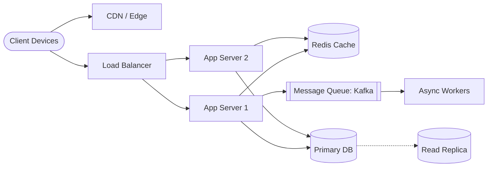

# System Design

> System Design is not one monolithic subject—it is a set of interconnected building blocks.

---

## 🗺️ The Architecture Map

### a) The Basics (Networking & Protocols)
- **What happens when you type a URL in the browser?**
- **DNS**: The phonebook of the internet.
- **CDN**: Content Delivery Networks (why static assets / YouTube load instantly).
- **Load Balancers**: Distributing traffic across server pools.
- **Protocols**: TCP vs UDP, HTTP/1.1 vs HTTP/2 vs HTTP/3, HTTP vs HTTPS (TLS/SSL handshakes).

### b) Data and Storage
- **SQL vs. NoSQL**: Relational consistency vs flexible schema/scale.
- **Postgres vs. MongoDB**: Use Postgres / ACID relational databases for transactional and financial data; avoid using document stores where relational integrity is critical.
- **Database Scaling**:
  - **Indexing**: B-Trees, Hash indexes, query optimization.
  - **Replication**: Primary-Replica (Master-Slave), read replicas, replication lag.
  - **Sharding & Partitioning**: Horizontal partitioning, shard keys, rebalancing.

### c) Scaling Techniques
- **Horizontal vs. Vertical Scaling**: Adding more nodes vs upgrading CPU/RAM.
- **Caching**:
  - Redis, Memcached.
  - Cache-aside, Write-through, Write-back, Cache invalidation strategies.
- **Load Balancing Algorithms**:
  - Round-robin, Weighted round-robin, Least connections, IP Hashing (sticky sessions).

### d) Architecture & Communication Patterns
- **Monolith vs. Microservices**: Service boundaries, domain-driven design, network boundaries.
- **Event-Driven Architecture**: Decoupling services via asynchronous event streams.
- **Message Queues & Pub/Sub**:
  - Kafka, RabbitMQ, SQS.
  - At-least-once, at-most-once, and exactly-once delivery semantics.

---

## 🧠 Mock Interview Framework

> *"Always talk about **tradeoffs**, not just choices."*

### Key Interview Channels
- [Gaurav Sen](https://www.youtube.com/playlist?list=PLMCXHnjXnTnvo6alSjVkgxV-VH6EPyvoX) — Explaining concepts from first principles.
- [Exponent](https://www.tryexponent.com/) — Real mock interviews with candidates.
- [ByteByteGo](https://bytebytego.com/) — Visual, storytelling architecture breakdowns.

### 5-Step System Design Template
1. **Clarifying Questions**: Understand the scope and constraints before proposing solutions.
2. **Requirements Definition**:
   - **Functional Requirements**: What the user/system actually does (e.g., post a tweet, send a message).
   - **Non-Functional Requirements**: High availability, low latency, consistency vs availability (CAP theorem), durability.
3. **Capacity Estimation (Back-of-the-envelope)**: Daily active users (DAU), read/write ratio, QPS, bandwidth, storage over 5 years.
4. **High-Level Design**:
   $$\text{Client} \longrightarrow \text{Load Balancer} \longrightarrow \text{API Gateway} \longrightarrow \text{App Servers} \longrightarrow \text{Cache} \longrightarrow \text{Database}$$
5. **Deep Dive & Bottlenecks**:
   - DB Schema & API Contracts.
   - Scaling hotspots, caching layers, and single points of failure (SPOF).
   - Failure modes & edge cases.

---

## 🎨 Visual System Diagramming

Sketching out architectures clarifies flows immediately:

---

## 🔗 High-Signal Engineering Blogs
- [Netflix Tech Blog](https://netflixtechblog.com/)
- [Uber Engineering Blog](https://www.uber.com/us/en/blog/engineering/)
- [Discord Engineering Blog](https://discord.com/category/engineering)
- [Shopify Engineering](https://shopify.engineering/)
- [GitHub Engineering](https://github.blog/engineering/)
- [Parsers & Lexers (Gopher Academy)](https://blog.gopheracademy.com/advent-2014/parsers-lexers/)

## 📚 Study Playlists & Courses
- [System Design Basics Playlist](https://www.youtube.com/playlist?list=PLinedj3B30sBlBWRox2V2tg9QJ2zr4M3o)
- [OS Playlist](https://youtube.com/playlist?list=PLDzeHZWIZsTr3nwuTegHLa2qlI81QweYG)
- [DBMS Playlist](https://www.youtube.com/playlist?list=PLDzeHZWIZsTpukecmA2p5rhHM14bl2dHU)
- [Himanshu Singour: How I Learned System Design](https://medium.com/@himanshusingour7/how-i-learned-system-design-d7444d454367)

---
*Related: [[Geohot - What is Programming]] | [[Computer Systems & Hardware]] | [[Programming Fundamentals]]*
