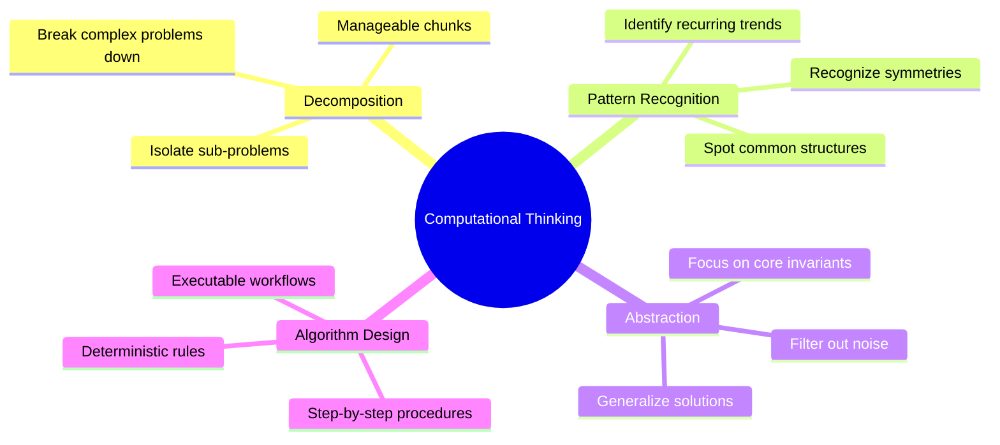

# Computational Thinking

> *"Apply computational thinking to the entire world. Systematize chaos into models and actionable steps."*

---

## The Four Pillars

### 1. Decomposition
- Break large, intimidating problems down into independent, bite-sized components.
- Solve and verify each component in isolation before integrating.

### 2. Pattern Recognition
- Observe recurring trends, similarities, and differences across different domains.
- If two problems share an underlying structure, the same solution archetype applies.

### 3. Abstraction
- Focus strictly on the information that matters for the task; deliberately ignore extraneous details.
- Create models that capture the invariant properties of a system.

### 4. Algorithm Design
- Develop unambiguous, step-by-step instructions or rules to solve the decomposed sub-problems every time.

---
*Related: [[Geohot - What is Programming]] | [[Interview & Communication Tips]]*
